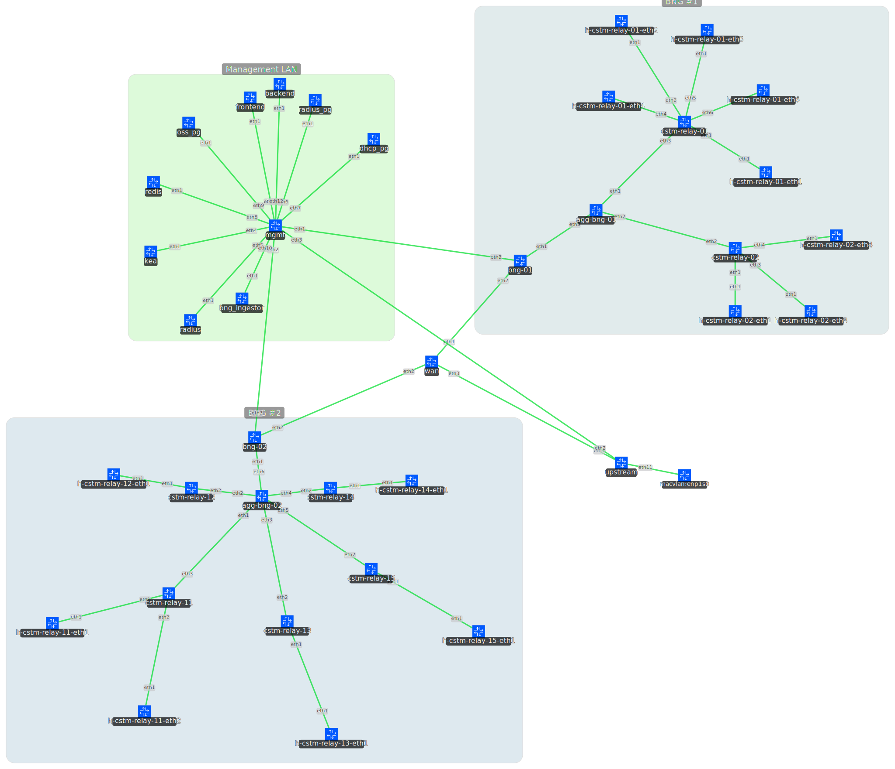

  

A full-stack operations support system for managing broadband subscriber sessions across a BNG infrastructure. Built on an event-driven architecture with real-time session tracking, RADIUS AAA integration, per-subscriber traffic accounting, and passive network discovery — all running in an emulated ISP topology via Containerlab.

## Architecture

14 containerized services on an isolated `192.0.2.0/24` network, orchestrated by [Containerlab](https://containerlab.dev).

### Data Plane

- **BNG** — Custom Python-based broadband network gateway. Intercepts DHCP traffic via raw `AF_PACKET` sockets, modifies Option 82 sub-options (circuit-id, remote-id, relay-id), and relays between subscribers and the DHCP server. Manages per-subscriber lifecycle including nftables-based traffic accounting, RADIUS authorization, and idle session detection.
- **Access Routers** — Nokia SR Linux switches acting as DHCP relay agents, injecting Option 82 metadata encoding the access port and subscriber ONU identifier.
- **Kea DHCP** — ISC Kea DHCPv4 server with PostgreSQL lease storage and a control agent API used for lease reconciliation.
- **FreeRADIUS** — Handles Access-Request/Accept/Reject and Accounting (Start/Interim-Update/Stop) with PostgreSQL-backed user profiles.

### Event Pipeline

Session lifecycle events flow from the BNG's event dispatcher into a Redis Stream (`bng_events`), consumed by an ingestor using consumer groups for reliable, at-least-once delivery with sequence-based idempotency.

| Event | Trigger |
|---|---|
| `SESSION_START` | DHCP ACK with new IP assignment |
| `SESSION_UPDATE` | Periodic interim accounting update |
| `SESSION_STOP` | DHCP RELEASE, lease expiry, idle timeout, or IP change |
| `POLICY_APPLY` | RADIUS Access-Accept or Reject received |
| `ROUTER_UPDATE` | Access router discovered via DHCP or ICMP health check |
| `BNG_HEALTH_UPDATE` | Periodic BNG resource utilization report (CPU, memory) |

### Persistence

- **`session_events`** — Immutable append-only event log, keyed by `(bng_id, bng_instance_id, seq)` for idempotent ingestion.
- **`sessions_active`** — Live subscriber sessions with real-time traffic counters. Atomically moved to `sessions_history` on session stop via `DELETE ... RETURNING` + `INSERT`.
- **`sessions_history`** — Archived sessions with GiST indexes on time ranges for efficient historical queries.
- **`access_routers`** — Passively discovered access router registry with ICMP liveness state.
- **`bng_registry`** / **`bng_health_events`** — BNG instance registry and time-series health metrics.

### Presentation

- **Backend** — Read-only FastAPI service over a PostgreSQL connection pool.
- **Frontend** — Next.js dashboard for session monitoring, traffic analytics, and network health.

## Design Decisions

**Passive router discovery** — Access routers are discovered by inspecting DHCP Option 82 circuit-id prefixes rather than relying on static config or management plane discovery. Per-router ICMP health checks are deferred when recent DHCP traffic already proves liveness.

**Sequence-based idempotency** — Each BNG instance maintains a monotonic sequence counter. The composite key in `session_events` guarantees exactly-once semantics at the persistence layer, even with at-least-once stream delivery.

**Two-phase session stop** — `SESSION_STOP` updates the active session with final traffic counters before atomically moving it to history, preventing data loss during the transition.

**Reconciliation loop** — A periodic reconciler queries Kea's control agent for authoritative lease state, recovering missed sessions and cleaning up zombies. Tombstones with TTL prevent the reconciler from re-creating intentionally terminated sessions.

## Tech Stack

| Layer | Technology |
|---|---|
| Network Emulation | Containerlab, Nokia SR Linux |
| BNG Core | Python, raw sockets (`AF_PACKET`), nftables |
| DHCP | ISC Kea, PostgreSQL |
| AAA | FreeRADIUS, PostgreSQL |
| Event Streaming | Redis Streams with consumer groups |
| Persistence | PostgreSQL |
| Backend | FastAPI, psycopg2 |
| Frontend | Next.js, React |

## Network Topology
This is the network topology for a standard two-BNG configuration.

## Screenshots

