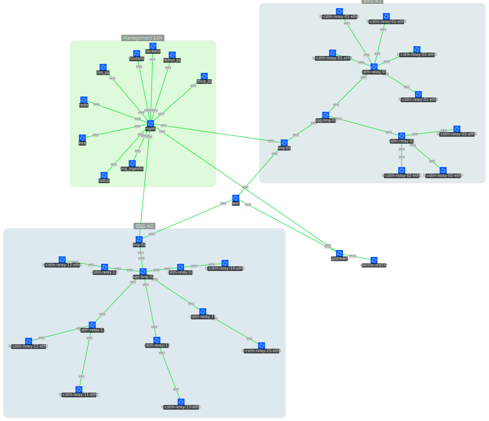

<br><br>

A full-stack ISP network lab that emulates IPoE IPv4 subscriber management end-to-end — from raw DHCP packet interception to real-time traffic dashboards. Built on an event-sourced architecture with RADIUS AAA, per-subscriber traffic shaping, and traffic simulation, all orchestrated via Containerlab.

## Table of Contents
- [What is Aether?](#what-is-aether)
- [Why I Built This](#why-i-built-this)
- [Architecture Overview](#architecture-overview)
  - [Egress Packet Path](#egress-packet-path)
- [How to Run](#how-to-run)
- [Core Components](#core-components)
  - [BNG Control Plane](#bng-control-plane)
    - [Why Python?](#why-python)
    - [Session Creation through Sniffed DHCP Packets](#session-creation-through-sniffed-dhcp-packets)
  - [Data Plane](#data-plane)
  - [DHCP Interception & Option 82](#dhcp-interception--option-82)
  - [RADIUS Integration](#radius-integration)
  - [Per-Subscriber Traffic Shaping](#per-subscriber-traffic-shaping)
  - [Event Bus (Redis Streams)](#event-bus-redis-streams)
  - [Provisioning UI](#provisioning-ui)
  - [Network Topology (Containerlab)](#network-topology-containerlab)
  - [Simulator (How is traffic automatically generated?)](#simulator-how-is-traffic-automatically-generated)
  - [Configuration-Driven Deployment](#configuration-driven-deployment)
    - [Adding a Third BNG](#adding-a-third-bng)
- [Infrastructure & Deployment](#infrastructure--deployment)
  - [Hosting](#hosting)
  - [Reverse Proxy & SSL](#reverse-proxy--ssl)
- [CI/CD Pipeline](#cicd-pipeline)
  - [Maintenance Mode](#maintenance-mode)
  - [Scheduled Redeployments](#scheduled-redeployments)
- [Project Status & Roadmap](#project-status--roadmap)
- [Caveats & Known Limitations](#caveats--known-limitations)
- [License](#license)
- [Screenshots](#screenshots)

## What is Aether?
Aether is a multi-BNG config-driven ISP infrastructure lab built almost from scratch that emulates IPoE IPv4 subscriber management end-to-end. It supports IPoE/Ipv4 networks with RADIUS AAA, per-subscriber traffic shaping, traffic simulation and so on emulated by Containerlab.

The entire lab is described in a single [aether.config.yaml](aether.config.yaml) — BNG count, access node topology, subscriber subnets, DHCP pools, service IPs. Running `make apply` renders all the derived artifacts via Jinja2 templates: the Containerlab topology, Kea DHCP config, RADIUS clients, nginx config, and the OSS database seed SQL. Nothing is hand-edited across those files — the config is the single source of truth.

This means spinning up a different topology (e.g. three BNGs with different subscriber subnets) is a matter of editing one YAML and re-running the pipeline. Along with that, the lab automatically generated mock-user traffic.

See [Adding a Third BNG](#adding-a-third-bng).

See [Simulator (How is traffic automatically generated?)](#simulator-how-is-traffic-automatically-generated)

## Why I Built This
Three years ago I was an intern assigned to build an entire ISP management console — NMS, BSS, the whole thing — by myself. I got through the business side (invoicing, CRM, inventory) but the networking was a black box I couldn't open,and I gave up. That never really left me. So three years later, I built the whole thing from scratch just to finally understand how it actually works.

This repository is meant to serve as a potential learning reference for anyone who's been in that same position: staring at closed-source vendor stacks with no foothold. _If you're just getting started, I hope this gives you one :)_

#### DISCLAIMER
This is my first project in the networking space, built over roughly a month. Some conventions are intentionally simplified or non-standard — this is a learning lab, not a standard production reference implementation. I would greatly apperciate feedbacks.

## Architecture Overview
The core component, the BNG, runs on an event-driven architecture where state changes are passed around as messages — no mutexes, no locks. To keep session state clean and predictable, the BNG never accepts external input directly. The one exception is the Go RADIUS CoA daemon, which passes CoA messages in via IPC sockets. Everything the BNG produces — events, session snapshots — gets pushed to Redis Streams, where the bng-ingestor picks them up, processes them, and persists them.

### Egress Packet path
For a packet egressing out to the internet, the general path looks like this:
```
host -> access node (relay_switch.py) -> aggregation switch (agg-bng-*) -> BNG -> WAN -> Upstream
```


## How to run
A production build is running on Hetzner Cloud at [aether.saphal.me](https://aether.saphal.me).

The build can also be ran locally using `Vagrant` with configuration in the `Vagrantfile`. 

```bash
vagrant up # Set up vagrant for the first time: downloads dependencies, builds docker images and runs the system
```

The `Vagrantfile` deployment is a WIP. It may fail in some systems.

## Core Components

### BNG Control Plane
The control plane is completely written in Python. Its an event-driven system with two queues: 
- a queue for periodic events(reconciler, auth_retry, bng_health, router_config_refresh, router_ping, radius_interim etc.)
- a queue for DHCP events. This queue is pushed to by [bng_dhcp_sniffer.py](bng/bng_dhcp_sniffer.py) which listens to AF_PACKET socket for IPv4 frames, try-parses DHCP packets and sends an event to the queue in the bng. More about it below.

#### Why Python?
Initially, I started out with [mininet](https://mininet.org/) which only supported python for orchestration of nodes. The primary reason I moved from mininet was that it shared the host network namespace and I needed containerized nodes for reproducability. I discovered a dockerized mininet-fork called [Containernet](https://containernet.github.io/) which provided dockerized the network nodes and each node has their own namespace. I faced issues with containernet due to legacy-code, effectively unmaintained library, Docker networking and NAT. So I finally made the final move to [Containerlab](https://containerlab.dev/). By this time, most of core BNG logic was already written. Hence, moving was an option with no real benefits on my learning.

#### Session creation through Sniffed DHCP packets
Originally, I used [dnsmasq](https://dnsmasq.org/doc.html) as my DHCP servers and session creation was based on polling-based read of the dnsmasq.leases file. This method was not reliable due to edge cases that arise from reading constantly written files. To detect expired leases, I either had to diff the file with the previous version or had to depend on the reconciler which introduced latency. Furthermore, to read current leases, the OSS-backend had to maintain a connection with the BNG to send leases which was against my design of preventing inbound connections to the BNG ( although the RADIUS CoA daemon breaks that rule now ).

I moved to a db-backed DHCP server [Kea](https://www.isc.org/kea/). Still, session creation depending on DHCP server's state was messy and wouldn't be ideal for a multi-BNG system. Hence, the idea of session creation by sniffing DHCP packets routed by the BNG came into existence.

As stated above, the BNG sniffs AF_PACKET socket for IPv4 frames and try-parses it as DHCP. If successfully parsed, the BNG performs these actions:

|DHCP Event|Action|
|--|--|
DHCP Request | Creates a pending session with empty state. This is used to correlated its corresponding ACK sent by the DHCP Server
DHCP Discover | Ignored
DHCP ACK | For pending sessions, it tries to authenticate with RADIUS and install nftables & traffic shaping rules. For renew with different IP, it terminates and recreates the session
DHCP NAK | Not implemented. This should delete the pending session after `DHCP_NAK_TERMINATE_COUNT_THRESHOLD` retries.
DHCP Release | Although not sent by every host, this graceful unauthenticates, delete nftables/traffic shaping rules, and tombstones the session.

In real scenarios, DHCP Release might not be sent due to reasons ( sudden disconnect, host doesn't send DHCP Release ). If the lease expires, it creates zombie session. The reconciler is responsible for cleaning up zombie sessions.

A **tombstone** is a short-lived in-memory record that marks a recently terminated session, preventing the reconciler from accidentally re-creating it when it sees the lease still active in Kea.

#### Periodic events
| Command | Trigger | Handler |
  |---|---|---|
  | `interim` | Every `interim_interval`s (default 30s) | Sends RADIUS Interim-Update for all active sessions with current traffic counters |
  | `reconcile` | Every `reconciler_interval`s (default 15s) or after every DHCP event | Queries Kea for authoritative lease state, recovers missed sessions, cleans up zombie sessions via tombstone checks |
  | `auth_retry` | Every `auth_retry_interval`s (default 10s) | Retries RADIUS authentication for sessions stuck in `PENDING_AUTH` with a valid IP |
  | `disconnection_check` | Every `disconnection_check_interval`s (default 5s) | No-op unless `ENABLE_IDLE_DISCONNECT=True`. Terminates sessions that have been `IDLE` longer than `MARK_DISCONNECT_GRACE_SECONDS` |
  | `router_config_refresh` | Every 60s | Reloads access router list from the OSS API |
  | `router_ping` | Every `router_ping_interval`s (default 30s) | Pings all known access routers and dispatches a `ROUTER_UPDATE` event on state change |
  | `bng_health` | Every `bng_health_check_interval`s (default 5s) | Reads cgroup CPU/memory metrics and dispatches a `BNG_HEALTH_UPDATE` event |
  | `coad_request` | On incoming CoA IPC connection | Handles `disconnect` (terminates session + tombstones) or `policy_change` (no-op, not yet implemented) |

### Data Plane

The data plane is entirely kernel-handled — the BNG control plane never touches subscriber packets directly with an exception of DHCP packets. On session authorization, the control plane programs two kernel subsystems:
  - nftables — per-session rules in the bngacct table for byte/packet accounting, and an authed_ips set that gates
  subscriber forwarding
  - tc/HTB — per-subscriber traffic shaping classes on both the subscriber-facing and uplink interfaces for
  upload/download rate enforcement

From that point on, all forwarding, counting, and shaping happens in-kernel with no userspace involvement until the next
   control event.

### DHCP Interception & Option 82
The DHCP option 82 injection is based on [RFC 3046](https://www.rfc-editor.org/rfc/rfc3046). Initially, Aether used MAC addresses as user identity which was volatile and was vulnerable to MAC spoofing. Hence, I made the decision to move Option 82 ( circuit_id + remote_id ) as the primary user identity. Although, this does introduce issues when the user moves to a different access point, it removed the MAC spoofing vulnerability. The `circuit_id` structure is an unconventional ( to make it easier and understandable ) `1/0/<subscriber-facing-interface>` and `remote_id` is basically a unique id given to an access point. 

So for a user connecting to interface `eth3` of `cstm-relay-01`, the `circuit_id` would be `1/0/3` and `remote_id` would be `cstm-relay-01`. The RADIUS username is prefixed by the BNG with its own unique identifer with the concatenation of these two option 82 sub options to produce the RADIUS username: `bng-01/cstm-relay-01/1/0/3`.

### RADIUS Integration
I am using RADIUS as my AAA server, specifically [freeRADIUS](https://www.freeradius.org/). The BNG communicates with the RADIUS server through the RADIUS protocol. The BNG currently builds the RADIUS packets and communicates with RADIUS using `radclient`. This should be replaced with `pyrad` library instead of manually handling packets. 

### Per-Subscriber Traffic Shaping
The custom BNG uses linux's tc traffic shaping with HTB qdisc. It shapes traffic on both ingress and egress.

### Event Bus (Redis Streams)
Since the BNG produces a lot of events, event streaming to a bus proved to be better than a request-response architecture between the OSS-backend and the BNG. This also decoupled the two systems. The `bng-ingestor` consumes the event streams and relays the data to proper destinations ( `oss-pg` for now but can be expanded ).

### Provisioning UI
The `frontend` is primarily in Next.js with shadcn, tailwindcss, and TanStack table. I forked the admin dashboard template from [next-shadcn-admin-dashboard](https://github.com/arhamkhnz/next-shadcn-admin-dashboard). The frontend is entirely assisted using Claude. I wanted to focus on the core networking side more than pretty UIs. 

### Network Topology (Containerlab)
The hosted demo of Aether has a 2-BNG deployment with ~7 access nodes totaling to ~68 containers. This is completely configurable through `aether.config.yaml` for local deployments.



### Simulator( How is traffic automatically generated?)
The simulator is a special `__LAB_ONLY` component that mounts host's docker (`/var/run/docker.sock`) socket and is able to communicate with all other containers in the network for simulation purposes. It executes the simulation commands by with `docker exec`. It is responsible for simulating the traffic in aether. The simulation commands are defined by a fixed allowlist for safety. Changes can be made to simulator configuration [simulator.config.json](simulator.config.json) to allow different commands, sleep range and weight to generate random traffic.

#### Disable simulator
To disable the simualtor, simply set the `container_fraction` and `customer_fraction` to `0.0` in [simulator.config.json](simulator.config.json).

```json
{
  "simulation": {
    "customer_fraction": 0.0, // The fraction of customers chosen to be assigned a random service
    "container_fraction": 0.0 // The fraction of hosts(containers) assigned to chosen customers
  }
  // ...
}
```
### Configuration-Driven Deployment

The entire lab is described in a single [aether.config.yaml](aether.config.yaml) — BNG count, access node topology, subscriber subnets, DHCP pools, service IPs. Running `make apply` renders all the derived artifacts via Jinja2 templates: the Containerlab topology, Kea DHCP config, RADIUS clients, nginx config, and the OSS database seed SQL. Nothing is hand-edited across those files — the config is the single source of truth.

This means spinning up a different topology (e.g. three BNGs with different subscriber subnets) is a matter of editing one YAML and re-running the pipeline.

### Adding a Third BNG
Due to configuration-driven deployment, adding a third BNG is as simple as:

```yaml
# aether.config.yaml
bngs:
    - bng-id: bng-01
      # ...existing config
    - bng-id: bng-02
      # ...existing config
    - bng-id: bng-03

      topology:
        interfaces:
          subscriber: eth1
          upstream: eth2
          dhcp-uplink: eth3

        ipv4:
          subscriber-cidr: 10.0.5.1/24
          upstream-cidr: 192.0.2.101/24
          dhcp-uplink-cidr: 198.18.0.101/24
          default-gw: 192.0.2.102
          nat-source-cidr: 10.0.5.0/24

      access-nodes:
        - node-config:
            remote-id: cstm-relay-31
            topology:
              interfaces:
                count: 4
            dhcp:
              ipv4:
                addr: 10.0.5.1
                subnet: 10.0.5.0/26
                pool-start: 10.0.5.10
                pool-end: 10.0.5.62
            uplink:
              ipv4-cidr: 10.0.5.2/24
              default-gw: 10.0.5.1
            bng-route:
              subnet: 10.0.5.0/26
              next-hop: 10.0.5.2
```
---

## Infrastructure & Deployment

### Hosting
The demo is hosted on Hetzner CX33 shared node with 4vCPU/8G RAM. Note that since the node is runnning on shared CPU because of cheaper costs,it means throughput test might result in unstable results due to noisy neighbors. `cloud_init.sh` installs all the required dependencies in the cloud.

### Reverse Proxy & SSL
There is a nginx proxy in-between containerlab and the node that routes to the interal nginx container. I understand that this double-nginx might not be the cleanest, but this lets me deploy locally and on the cloud with similar configuration while imitating an actual ISP infrastructure. The hosted version also contains nginx.conf for maintenance mode i.e the page I show when aether is redeploying.

SSL/TLS is done by certbot through Let's Encrypt.

---

## CI/CD Pipeline
The CI/CD is as simple as it can be. On push to the main branch or user-triggered deployment, it does SSH into the VPS, executes `git pull` and `make apply-prod`.

### Maintenance Mode
Redeployment times typical range from 20s - 5mins. For UX purposes, the hosted demo shows a redeploying message with relevant information about the deployment. `NOTICE:` This is only for the hosted demo verison, and doesn't apply to local deployment.

### Scheduled Redeployments
The live demo resets every 6 hours — this clears any subscriber data created by visitors and works around occasional OOM kills under extended load (under investigation).

---

## Project Status & Roadmap
The roadmaps for this projects are discussed in the [ROADMAP.md](./ROADMAP.md)

---

## Caveats & Known Limitations
- Throughput — Multiple veth hops through the emulated topology add significant overhead. Profiling with iperf3 (-P 10 -t 10, 9500 MTU, 24 vCPUs) shows BNG→upstream at ~24 Gbit/s, but host→BNG→upstream drops to ~3.5 Gbit/s. The 9500 MTU, used to profile maximum possible throughput, also isn't representative of real ISP deployments. TC-BPF is worth exploring as a path forward.

- Handle collision at /8 boundaries — The HTB class handle is derived from the 3rd and 4th IP octets (c * 256 + d). This is collision-free within a /16 but would collide across subnets if subscriber IPs from different /16 blocks are assigned to the same BNG instance. It's also limited to ~65000 handles, which really isn't an issue for this lab.

- This lab is strictly for IPoE IPv4 networks. There will be no support for IPv6.
- No Rate limiting and only basic security on frontend and backend.

## License
MIT License. See [LICENSE](./LICENSE)

## Screenshots


### Tech Stack
[]()
